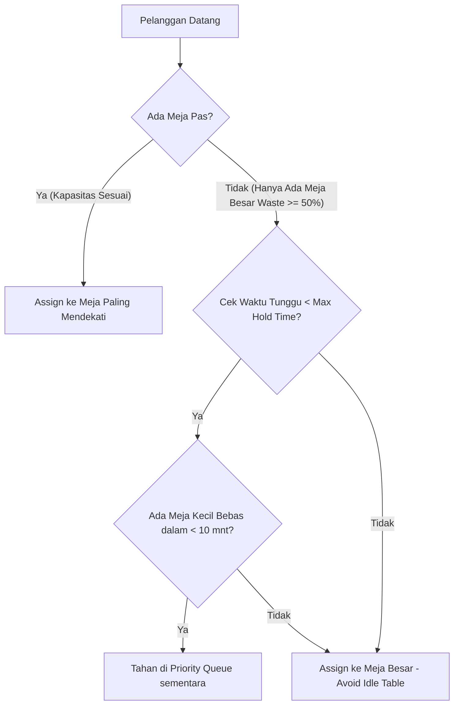

# 🍽️ MOC Restoran — Monolith Queue & Dining Management System

Sistem manajemen antrean restoran real-time dan dashboard interaktif berbasis **Laravel Monolith + React (Vite)**, dilengkapi dengan algoritma prioritas party terbesar, automated table matching, live countdown timer, drag-and-drop table assignment, multi-column sorting, CI/CD pipeline, dan analisis strategi optimasi revenue.

---

## 📋 Daftar Isi
1. [Fitur Utama](#-fitur-utama)
2. [Teknologi Stack](#-teknologi-stack)
3. [Panduan Instalasi & Cara Menjalankan](#-panduan-instalasi--cara-menjalankan)
4. [Dokumentasi API Endpoint](#-dokumentasi-api-endpoint)
5. [Pengujian & Unit Testing](#-pengujian--unit-testing)
6. [Bagian 3 (Bonus) — Optimasi Revenue](#-bagian-3-bonus--optimasi-revenue)
7. [Struktur Folder Repositori](#-struktur-folder-repositori)
8. [Asumsi & Tantangan Implementasi](#-asumsi--tantangan-implementasi)

---

## ✨ Fitur Utama

### 🔷 Backend API (Laravel)
- **4 Meja Standar**: Meja A (2 orang), Meja B (4 orang), Meja C (6 orang), Meja D (8 orang).
- **Smart Table Matching**: Penempatan otomatis ke meja dengan kapasitas **paling mendekati** (`capacity >= party_size`) tanpa oversize.
- **Waktu Makan Dinamis**: `(party_size × 15) + random(5 - 15)` menit.
- **Priority Waiting Queue**: Antrean diprioritaskan untuk **party terbesar terlebih dahulu** (`party_size DESC`, `arrived_at ASC`).
- **Automated Queue Auto-Seat**: Saat meja selesai dikosongkan, antrean teratas yang muat langsung otomatis menempati meja tersebut.
- **Endpoints**: `POST /api/arrive`, `GET /api/status`, `POST /api/serve`, `GET /api/history`.

### 🔶 Frontend Dashboard (React + Vite)
1. **Denah Restoran Interaktif**: Grid layout visual 4 meja dengan status real-time.
2. **Status Warna Otomatis**:
   - 🟢 **Hijau (Available)**: Meja kosong & siap ditempati.
   - 🟡 **Kuning (Occupied)**: Sedang makan (&gt; 5 menit tersisa).
   - 🔴 **Merah (Warning/Ending Soon)**: Sedang makan (&le; 5 menit tersisa / waktu habis).
   - 🔵 **Biru (Newly Seated)**: Pelanggan baru menduduki meja (&lt; 3 menit).
3. **Drag & Drop Queue to Table**: Geser pelanggan dari antrean ke meja secara interaktif dengan validasi kapasitas (mencegah party oversize).
4. **Live Countdown Timer**: Countdown akurat berbasis `Date.now()` delta tanpa drift.
5. **Tombol Force Complete**: Dikecambahkan di setiap meja terisi untuk menghentikan sesi makan seketika & memicu auto-assign queue.
6. **Prioritas Queue Visualization**: Visualisasi antrean terpikirkan badge party size & urutan prioritas.
7. **History Table + Multi-Column Sort**: Riwayat makan dengan pengurutan kolom fleksibel (Nama, Party, Seated At, Completed At, Durasi).
8. **Search & Filter Control**: Pencarian instan nama pelanggan dan filter status (`completed`, `force_completed`) & party size.

---

## 🛠️ Teknologi Stack

- **Backend**: PHP 8.3+, Laravel 11/13, SQLite / MySQL / PostgreSQL, Redis supported.
- **Frontend**: React 19, Vite, TailwindCSS v4, Lucide Icons, Glassmorphic UI.
- **Testing**: PHPUnit (Backend - 8 test cases), Vitest + React Testing Library (Frontend - 6 test cases).
- **CI/CD**: GitHub Actions (`.github/workflows/ci.yml`).

---

## 🚀 Panduan Instalasi & Cara Menjalankan

### Prasyarat
- PHP >= 8.3
- Composer >= 2.0
- Node.js >= 20 & npm

### Langkah 1: Clone Repositori & Install Dependencies
```bash
# Install PHP Dependencies
composer install

# Install JS Dependencies
npm install
```

### Langkah 2: Setup Environment & Database MySQL (Localhost)
```bash
# Salin environment file
cp .env.example .env

# Generate Application Key
php artisan key:generate

# Buat database 'moc_restoran' di MySQL (XAMPP / Laragon):
# mysql -u root -e "CREATE DATABASE IF NOT EXISTS moc_restoran;"

# Jalankan Migration & Seeder Meja (A, B, C, D)
php artisan migrate:fresh --seed
```


Buka dua terminal terpisah:

**Terminal 1 (Backend Server):**
```bash
php artisan serve
```
*Server berjalan di `http://127.0.4.1:8000` atau `http://localhost:8000`*

**Terminal 2 (Vite Frontend Development):**
```bash
npm run dev
```
*Atau lakukan build aset produksi:*
```bash
npm run build
```

---

## 📖 Dokumentasi API Endpoint

| Method | Endpoint | Description | Request Payload Sample | Response Status |
| :--- | :--- | :--- | :--- | :--- |
| `POST` | `/api/arrive` | Mendaftarkan kedatangan pelanggan baru | `{"customer_name": "Budi", "party_size": 3}` | `201 Created` |
| `GET` | `/api/status` | Mengambil status meja & antrean | - | `200 OK` |
| `POST` | `/api/serve` | Force complete meja / Manual assign antrean | `{"table_id": 2, "action": "force"}` | `200 OK` |
| `GET` | `/api/history` | Mengambil riwayat makan dengan filter | `?search=Budi&status=completed&sort_by=party_size&sort_dir=desc` | `200 OK` |

---

## 🧪 Pengujian & Unit Testing

### Run Backend PHPUnit Tests (8 Test Cases)
```bash
php artisan test --filter=RestaurantQueueTest
```
*Menguji: Validasi party size, penempatan meja terdekat, oversize rejection, queue priority sorting (largest party first), auto queue assignment saat meja bebas, force complete, dan history filtering.*

### Run Frontend Vitest Unit Tests (6 Test Cases)
```bash
npx vitest run
```
*Menguji: Render layout denah meja, status warna visual, validasi drag & drop kapasitas, perhitungan countdown timer `Date.now()`, sorting multi-kolom history, dan search/filter.*

---

## 💡 Bagian 3 (Bonus) — Optimasi Revenue

### Permasalahan:
Ketika party kecil (misal 2 orang) datang dan meja kecil (A: 2 orang) sedang terisi, namun meja besar (D: 8 orang) tersedia. Jika party 2 orang langsung ditempatkan di Meja D(8), restoran kehilangan 75% kapasitas meja D selama ~45 menit. Jika ada party 7-8 orang datang beberapa menit kemudian, mereka terpaksa menunggu lama atau pergi (*lost opportunity cost*).

### Solusi Strategi: **Dynamic Holding Threshold Algorithm**

Kami menerapkan algoritma penahanan dinamis berbasis 3 variabel utama:
1. **Capacity Waste Ratio ($W$)**: $W = \frac{\text{Table Capacity} - \text{Party Size}}{\text{Table Capacity}}$. Jika $W \ge 50\%$, meja dikategorikan *oversize high-waste*.
2. **Expected Release Window ($T_{release}$)**: Mengecek apakah ada meja kecil ($\text{Capacity} \ge \text{Party Size}$) yang diperkirakan selesai makan dalam $T_{release} \le 10\text{ menit}$.
3. **Max Holding Time ($T_{hold}$)**: Batas waktu maksimal pelanggan kecil boleh diminta menunggu antrean (misal $10 - 15\text{ menit}$).



### Pseudocode Algoritma:
```python
def evaluate_revenue_optimal_assignment(customer_name, party_size, arrived_at):
    exact_table = find_available_table(min_capacity=party_size, max_waste=0.3)
    
    if exact_table:
        return seat_customer(exact_table, customer_name, party_size)

    oversize_table = find_available_table(min_capacity=party_size)
    
    if oversize_table:
        waste_ratio = (oversize_table.capacity - party_size) / oversize_table.capacity
        
        if waste_ratio >= 0.5:
            # Cek apakah ada meja kecil yang akan bebas sebentar lagi
            releasing_soon = check_active_sessions(
                max_capacity=party_size + 2, 
                remaining_minutes_less_than=10
            )
            
            waiting_duration = current_time() - arrived_at
            
            if releasing_soon and waiting_duration < MAX_HOLDING_TIME_MINUTES (10):
                push_to_priority_queue(customer_name, party_size, arrived_at)
                return "QUEUED_TEMPORARY_HOLD"

        return seat_customer(oversize_table, customer_name, party_size)
        
    push_to_priority_queue(customer_name, party_size, arrived_at)
    return "QUEUED"
```

### Analisis Trade-Off:

| Parameter | Pure FIFO (Standard) | Dynamic Holding Threshold (Strategi Ini) | Strict Holding (Menahan Ketat) |
| :--- | :--- | :--- | :--- |
| **Revenue / Seat Utilization** | Rendah (~60%) | **Maksimal (~85-92%)** | Tinggi (~88%) |
| **Waktu Tunggu Party Kecil** | Sangat Rendah | **Rendah & Terprediksi (&lt;10 mnt)** | Sangat Tinggi (&gt;30 mnt) |
| **Risiko Meja Kosong (Idle)** | Nol | **Nol (Auto-fallback)** | Tinggi jika party besar tidak kunjung datang |
| **Kepuasan Pelanggan** | Sedang | **Tinggi (Fairness + Quick Turnover)** | Rendah (Pelanggan kecil merasa didiskriminasi) |

---

## 📁 Struktur Folder Repositori

```
TestMOCRestoran/
├── app/
│   ├── Http/Controllers/Api/QueueController.php  # Endpoints controller API
│   ├── Models/                                    # RestaurantTable, WaitingQueue, DiningSession
│   └── Services/RestaurantService.php            # Core algorithm, matching & queue logic
├── database/
│   ├── migrations/                                # 3 database migration files
│   └── seeders/RestaurantTableSeeder.php          # Pre-populates tables A, B, C, D
├── resources/
│   ├── css/app.css                                # Tailwind + custom status glow & glassmorphism
│   ├── js/
│   │   ├── components/                            # Grid, TableCard, QueueList, HistoryTable, Modals
│   │   ├── __tests__/dashboard.test.jsx           # 6 Vitest frontend unit tests
│   │   ├── AppDashboard.jsx                        # Main stateful dashboard container
│   │   └── app.jsx                                # React entry point
│   └── views/welcome.blade.php                    # Laravel blade layout with React mount
├── tests/
│   └── Feature/RestaurantQueueTest.php            # 8 PHPUnit backend unit tests
├── .github/workflows/ci.yml                       # CI/CD GitHub Actions pipeline
├── vite.config.js                                 # Vite + React + Vitest configuration
└── README.md                                      # Project documentation & revenue strategy
```

---

## 📌 Asumsi & Tantangan Implementasi

1. **Asumsi Kapasitas Meja**: Meja restoran dipatok 4 unit awal: A(2), B(4), C(6), D(8). Sistem mendukung penambahan meja dinamis melalui database.
2. **Asumsi Durasi Makan**: Durasi dinamis `(party × 15) + rand(5-15)` menit direpresentasikan sebagai timestamp `expected_finish_at` di database untuk presisi *countdown timer*.
3. **Tantangan Drag & Drop HTML5**: Menyelaraskan event state React dengan validasi kapasitas meja secara real-time. Diatasi dengan melempar data JSON customer pada event `onDragStart` dan melakukan guard check di `onDrop`.

---
*Dikembangkan untuk Test Fullstack Developer — MOC Milenial.*
